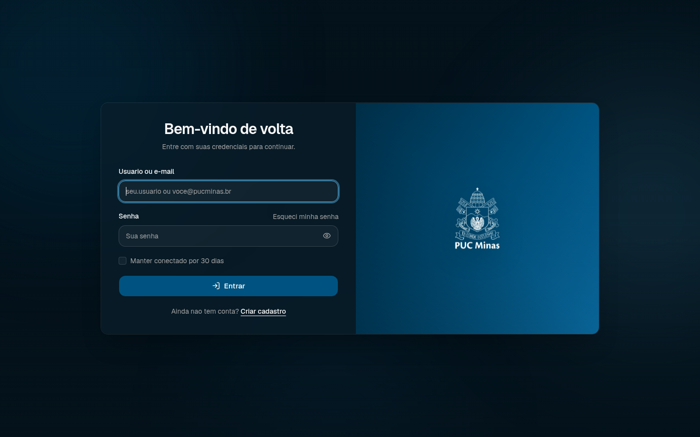
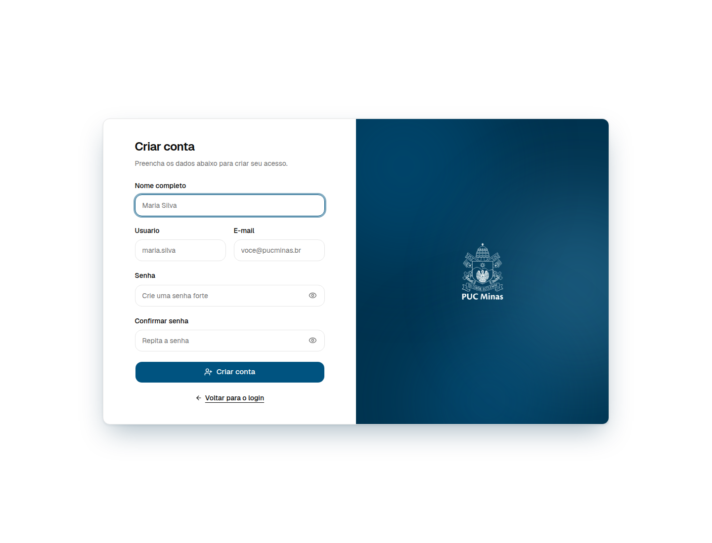
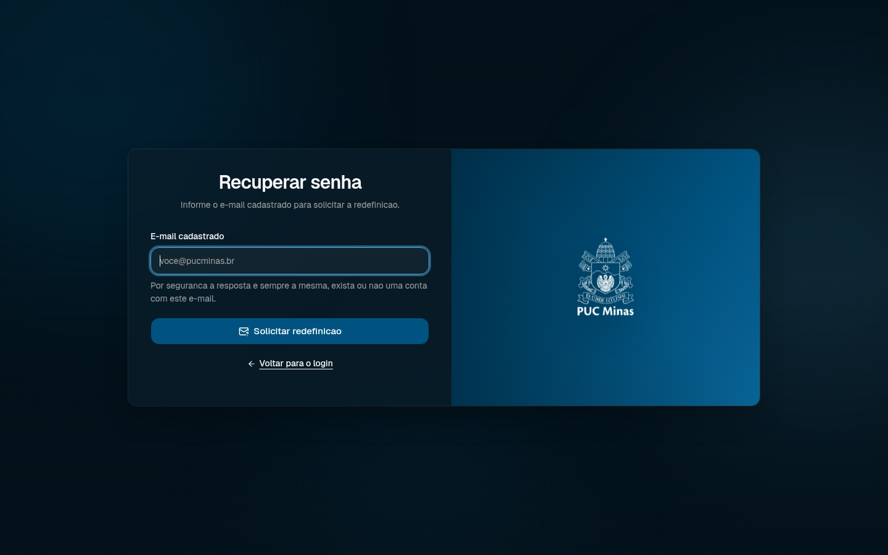
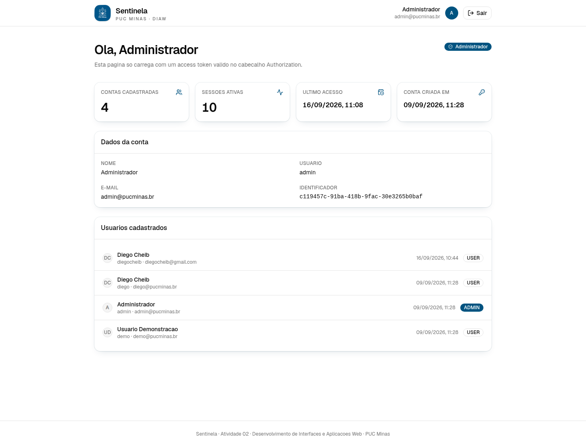
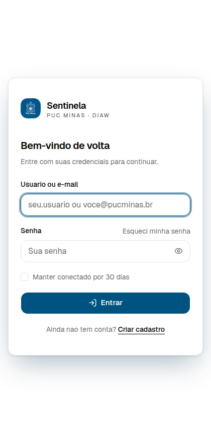

<div align="center">


# Sentinela

**Autenticação com Spring Boot + JWT e interface em React**

Atividade 02 · Desenvolvimento de Interfaces e Aplicações Web (DIAW) · PUC Minas


</div>

---

## Sobre o projeto

O **Sentinela** é uma aplicação web completa de login e cadastro de usuários.

O enunciado da atividade pedia Thymeleaf para as telas. Optei por uma arquitetura desacoplada:
o backend expõe uma **API REST stateless autenticada por JWT** e o frontend é uma **SPA em React**
que consome essa API. O resultado atende aos mesmos requisitos (telas de login, cadastro e
recuperação de senha, autenticação, senhas com hash e rotas protegidas) com uma separação clara
entre servidor e interface.

Em produção o próprio Spring Boot serve o build do React, de modo que a aplicação inteira roda em
um único processo, na porta 8080.

## Telas

| Login | Cadastro |
|---|---|
|  |  |

| Recuperação de senha | Área protegida |
|---|---|
|  |  |

<div align="center">
  
  <br><em>Layout responsivo</em>
</div>

## Tecnologias

**Backend**

| Recurso | Uso |
|---|---|
| Java 17 + Spring Boot 3.5 | Base da aplicação |
| Spring Security 6 | Filtros, autorização e política de acesso |
| Spring Data JPA + Hibernate | Persistência |
| H2 (arquivo) / PostgreSQL | Banco de dados por perfil |
| JJWT 0.12 | Emissão e validação dos tokens |
| BCrypt (força 12) | Hash das senhas |
| Bean Validation | Validação dos formulários no servidor |
| Resend | Envio transacional dos links de redefinição de senha |
| JUnit 5 + MockMvc | Testes automatizados |

**Frontend**

| Recurso | Uso |
|---|---|
| React 19 + TypeScript | Interface |
| Vite 8 | Build e servidor de desenvolvimento |
| React Router 7 | Rotas e proteção de páginas |
| Tailwind CSS 4 | Estilos |
| shadcn/ui (base-ui) | Componentes de formulário |
| lucide-react | Ícones |

## Estrutura do projeto

```
Atividade-02-DIAW/
├── backend/
│   ├── src/main/java/br/pucminas/diaw/sentinela/
│   │   ├── config/         SecurityConfig, CORS, propriedades, carga inicial
│   │   ├── controller/     AuthController, DashboardController, AdminController
│   │   ├── domain/         User, RefreshToken, PasswordResetToken, Role
│   │   ├── dto/            Requests e responses (records)
│   │   ├── exception/      ApiException e tratamento global de erros
│   │   ├── repository/     Repositórios Spring Data
│   │   ├── security/       JwtService, filtro JWT, cookies, UserDetails
│   │   ├── service/        Autenticação, recuperação de senha e envio pelo Resend
│   │   └── validation/     @StrongPassword e @PasswordConfirmation
│   ├── src/main/resources/
│   │   ├── application.yml         Perfil padrão (H2 em arquivo)
│   │   └── application-prod.yml    Perfil de produção (PostgreSQL)
│   └── src/test/java/...           Testes unitários e de integração
│
├── frontend/
│   ├── public/             Favicons e logo da PUC Minas
│   └── src/
│       ├── components/     Formulários, layout, guardas de rota, ui/ (shadcn)
│       ├── context/        AuthProvider
│       ├── hooks/          useAuth
│       ├── lib/            Cliente HTTP com renovação automática de token
│       ├── pages/          login, register, recuperação/redefinição, dashboard, 404
│       └── index.css       Tema e identidade visual
│
└── docs/                   Imagens usadas neste README
```

## Como executar

### Pré-requisitos

| Requisito | Versão mínima | Como conferir |
|---|---|---|
| JDK | 17 | `java -version` |
| Node.js | 20 | `node -v` |
| Maven | não precisa instalar | o projeto traz o wrapper `./mvnw` |

---

### Passo 1 · Clonar o repositório

```bash
git clone https://github.com/DiegoCheib/Atividade-02-DIAW.git
cd Atividade-02-DIAW
```

---

### Passo 2 · Configurar o `backend/.env`

> [!IMPORTANT]
> É aqui que entra a **`RESEND_API_KEY`**. Sem ela a aplicação sobe e todo o resto funciona,
> mas o e-mail de recuperação de senha **não é enviado**: o link aparece apenas no log do backend.

```bash
cd backend
cp .env.example .env
```

Abra o arquivo `backend/.env` e preencha as duas variáveis abaixo.

#### `RESEND_API_KEY` — obrigatória para o envio do e-mail

O envio é feito pela API do [Resend](https://resend.com). Para obter a chave:

1. Crie uma conta gratuita em **<https://resend.com>** e confirme o e-mail.
2. Acesse **API Keys** no menu lateral e clique em **Create API Key**.
3. Dê um nome qualquer (ex.: `sentinela-local`) e deixe a permissão em **Sending access**.
4. Copie a chave gerada. Ela começa com `re_` e **só é exibida uma vez**.
5. Cole no `.env`:

```dotenv
RESEND_API_KEY=re_sua_chave_aqui
```

> [!WARNING]
> O remetente padrão `onboarding@resend.dev` é o endereço de testes do Resend e **só entrega
> mensagens na caixa de entrada do dono da conta**. Para enviar a qualquer destinatário é preciso
> verificar um domínio próprio no Resend e apontar `MAIL_FROM` para um endereço desse domínio.

#### `JWT_SECRET` — recomendada

Chave HMAC que assina os tokens. Precisa de no mínimo 32 caracteres. Sem ela, uma chave aleatória é
sorteada a cada start e todas as sessões caem quando o backend reinicia.

```bash
openssl rand -base64 48
```

Cole o resultado no `.env`:

```dotenv
JWT_SECRET=cole_aqui_o_valor_gerado
```

O arquivo `.env` está coberto pelo `.gitignore` e nunca vai para o repositório.

---

### Passo 3 · Subir o backend

No primeiro start o Maven baixa as dependências, o que leva alguns minutos.

```bash
cd backend
./mvnw spring-boot:run
```

A API fica em **<http://localhost:8080>**. Para conferir que subiu:

```bash
curl http://localhost:8080/api/health
# {"application":"Sentinela","time":"...","status":"UP"}
```

---

### Passo 4 · Subir o frontend

Em **outro terminal**, com o backend rodando:

```bash
cd frontend
npm install
npm run dev
```

A interface fica em **<http://localhost:5173>**.

---

### Passo 5 · Acessar

Abra **<http://localhost:5173/login>** e entre com uma das
[contas de demonstração](#contas-de-demonstração), ou crie a sua em `/register`.

O Vite encaminha as chamadas `/api` para a porta 8080, então não há problema de CORS durante o
desenvolvimento e o cookie de sessão continua funcionando.

---

### Testando a recuperação de senha

1. Em `/login`, clique em **Esqueci minha senha**.
2. Informe o e-mail de uma conta cadastrada e envie.
3. **Com `RESEND_API_KEY` configurada:** o link chega por e-mail. Confira também o spam.
4. **Sem a chave:** o link aparece no terminal do backend, em uma linha como

```
Conteudo em texto do e-mail nao enviado:
...
http://localhost:5173/resetpassword?token=AbC123...
```

Abra o link no navegador para escolher a nova senha. Ele vale por 30 minutos, só pode ser usado uma
vez e, ao ser consumido, derruba todas as sessões abertas daquela conta.

---

### Modo produção (aplicação única, um só processo)

Neste modo o Spring Boot serve o build do React e a API na mesma porta, dispensando o Vite.

```bash
# 1. Gera o build do React dentro dos recursos estáticos do Spring
cd frontend && npm install && npm run build

# 2. Sobe a aplicação completa
cd ../backend && ./mvnw spring-boot:run
```

Acesse **<http://localhost:8080/login>**.

Para gerar o JAR executável com tudo dentro, sem precisar rodar o `npm` à mão:

```bash
cd backend
./mvnw -Pfullstack clean package     # compila o React e empacota junto
java -jar target/sentinela-1.0.0.jar
```

O perfil `fullstack` baixa o Node automaticamente, então não é preciso tê-lo instalado para esse
comando.

---

### Testes

```bash
cd backend
./mvnw test
```

São 28 testes: política de senha, emissão e validação de JWT e os fluxos completos de autenticação
e redefinição de senha com MockMvc (token de uso único, troca de senha e revogação das sessões).
Os testes não enviam e-mail e não dependem da `RESEND_API_KEY`.

---

### Se algo der errado

| Sintoma | Causa provável | Solução |
|---|---|---|
| `Port 8080 is already in use` | outra aplicação ocupa a porta | `SERVER_PORT=8081 ./mvnw spring-boot:run` |
| O e-mail não chega | chave ausente, ou remetente de teste | Confira `RESEND_API_KEY` no `.env`. Com `onboarding@resend.dev` só chega no e-mail dono da conta Resend |
| Login cai a cada reinício do backend | `JWT_SECRET` vazia | Defina uma chave fixa no `.env` |
| A tela carrega mas toda chamada falha | backend fora do ar | Confira o terminal do backend e o `curl` do passo 3 |
| `404` ao abrir `/dashboard` direto na porta 8080 | build do React desatualizado | Rode `npm run build` no `frontend` de novo |
| Quero inspecionar o banco | — | Suba com `H2_CONSOLE=true` e acesse `/h2-console` com a URL `jdbc:h2:file:./data/sentinela` |

## Contas de demonstração

Criadas automaticamente no primeiro start, para facilitar a avaliação.

| E-mail | Usuário | Senha | Perfil |
|---|---|---|---|
| `admin@pucminas.br` | `admin` | `Admin@1234` | ADMIN |
| `demo@pucminas.br` | `demo` | `Demo@1234` | USER |

Desative com `DEMO_USER=false` (ou use o perfil `prod`, onde já vêm desligadas).

## Endpoints

### Exigidos pela atividade

| Método | Endpoint | Descrição |
|---|---|---|
| GET | `/login` | Exibe a tela de login |
| GET | `/register` | Exibe a tela de cadastro |
| POST | `/register` | Processa os dados do cadastro |
| GET | `/recoverpassword` | Exibe a tela de recuperação de senha |
| POST | `/recoverpassword` | Processa a solicitação de recuperação |

As rotas `GET` são atendidas pelo React Router. Quando o build está empacotado no backend, o
Spring encaminha esses caminhos para o `index.html` (veja `WebConfig`), então os endpoints
respondem tanto no servidor de desenvolvimento quanto na aplicação final.

Os `POST` acima existem como atalhos e delegam para os endpoints canônicos da API, que são os
efetivamente consumidos pelo React.

### API REST

| Método | Endpoint | Autenticação | Descrição |
|---|---|---|---|
| POST | `/api/auth/register` | pública | Cadastra um usuário. Responde `201` com os dados públicos |
| POST | `/api/auth/login` | pública | Valida credenciais, devolve o access token e grava o cookie de refresh |
| POST | `/api/auth/refresh` | cookie | Rotaciona o refresh token e emite um novo access token |
| POST | `/api/auth/logout` | cookie | Revoga a sessão e limpa o cookie |
| GET | `/api/auth/me` | Bearer | Dados do usuário autenticado |
| POST | `/api/auth/recoverpassword` | pública | Gera o token e envia o link de redefinição |
| GET | `/api/auth/resetpassword?token=...` | pública | Verifica se o link ainda é válido |
| POST | `/api/auth/resetpassword` | pública | Valida o token e grava a nova senha |
| GET | `/api/dashboard` | Bearer | Resumo da área protegida |
| GET | `/api/admin/users` | Bearer + ADMIN | Lista todos os usuários |
| GET | `/api/health` | pública | Verificação de disponibilidade |

Exemplos:

```bash
# Cadastro
curl -X POST http://localhost:8080/api/auth/register \
  -H 'Content-Type: application/json' \
  -d '{"name":"Maria Silva","username":"maria","email":"maria@pucminas.br",
       "password":"Senha@2026","confirmPassword":"Senha@2026"}'

# Login (guarda o cookie de refresh em cookies.txt)
curl -c cookies.txt -X POST http://localhost:8080/api/auth/login \
  -H 'Content-Type: application/json' \
  -d '{"identifier":"maria@pucminas.br","password":"Senha@2026","rememberMe":false}'

# Área protegida
curl http://localhost:8080/api/dashboard -H "Authorization: Bearer <access_token>"
```

Erros seguem sempre o mesmo formato, o que permite ao formulário destacar o campo exato:

```json
{
  "timestamp": "2026-09-09T14:28:24.903Z",
  "status": 400,
  "error": "Bad Request",
  "message": "Verifique os dados informados",
  "path": "/api/auth/register",
  "fieldErrors": [
    { "field": "password", "message": "A senha deve ter no minimo 8 caracteres, com letra maiuscula, minuscula, numero e simbolo" }
  ]
}
```

## Como a autenticação funciona

```
Navegador                          Spring Boot
   │                                    │
   │  POST /api/auth/login              │
   ├───────────────────────────────────►│  valida com BCrypt
   │                                    │
   │  access token (JSON, 15 min)       │  refresh token (cookie HttpOnly, 7 ou 30 dias)
   │◄───────────────────────────────────┤
   │                                    │
   │  GET /api/dashboard                │
   │  Authorization: Bearer <token>     │
   ├───────────────────────────────────►│  JwtAuthenticationFilter valida a assinatura
   │                                    │  e recarrega o usuário do banco
   │                                    │
   │  token expirou → 401               │
   │  POST /api/auth/refresh (cookie)   │
   ├───────────────────────────────────►│  revoga o token antigo e emite um novo par
   │◄───────────────────────────────────┤
```

Decisões de segurança adotadas:

- **Senhas com BCrypt de força 12.** Nenhuma senha trafega ou é gravada em texto puro.
- **Access token curto (15 minutos)** guardado apenas em memória no React. Não usamos
  `localStorage`, o que reduz o impacto de um eventual XSS.
- **Refresh token opaco em cookie `HttpOnly`**, inacessível ao JavaScript. No banco fica apenas o
  hash SHA-256 do token, com caminho restrito a `/api/auth` e `SameSite`.
- **Rotação de refresh token.** Cada renovação invalida o token anterior. Se um token já usado
  reaparece, todas as sessões do usuário são revogadas.
- **Bloqueio temporário** de 15 minutos após 5 tentativas de login malsucedidas, por combinação de
  identificador e IP.
- **Mensagem genérica no login.** A resposta não revela se o erro foi no usuário ou na senha.
- **Recuperação de senha sem enumeração de contas.** A resposta é a mesma exista ou não o e-mail.
- **Autorização por perfil** com `@PreAuthorize`, validada por testes.
- **CORS restrito** às origens configuradas, e cabeçalhos de segurança incluindo CSP.

## Validações

Aplicadas no React para resposta imediata e novamente no servidor, que é a fonte de verdade.

| Campo | Regra |
|---|---|
| Nome | Obrigatório, de 3 a 120 caracteres |
| Usuário | De 3 a 40 caracteres, apenas letras, números, ponto, hífen e underline. Único |
| E-mail | Formato válido, até 180 caracteres. Único |
| Senha | Mínimo de 8 caracteres, com maiúscula, minúscula, número e símbolo |
| Confirmação | Precisa ser idêntica à senha |

O cadastro exibe um medidor de força que espelha exatamente a regra do backend. Usuário e e-mail
duplicados retornam `409` apontando o campo em conflito.

## Configuração e credenciais

Nenhum segredo está no código. Tudo vem de variáveis de ambiente, com valores padrão apenas para
desenvolvimento local. O arquivo `backend/.env.example` documenta as variáveis; copie para `.env`
ou exporte no shell.

| Variável | Necessária? | Padrão | Descrição |
|---|---|---|---|
| `RESEND_API_KEY` | **Sim, para o e-mail** | — | Chave `re_...` criada em <https://resend.com/api-keys>. Sem ela o envio fica desligado e o link de redefinição vai apenas para o log |
| `JWT_SECRET` | Recomendada | *(sorteada a cada start)* | Chave HMAC de assinatura. **Mínimo de 32 caracteres.** Sem ela as sessões caem a cada reinício |
| `MAIL_FROM` | Não | `Sentinela <onboarding@resend.dev>` | Remetente. O padrão só entrega no e-mail dono da conta Resend; para qualquer destinatário, use um domínio verificado |
| `APP_BASE_URL` | Não | `http://localhost:5173` | Origem usada para montar o link do e-mail |
| `MAIL_REPLY_TO` | Não | — | Endereço opcional para respostas |
| `CORS_ORIGINS` | Não | `http://localhost:5173,http://localhost:4173` | Origens liberadas, separadas por vírgula |
| `COOKIE_SECURE` | Não | `false` | Use `true` em produção, para enviar o cookie só por HTTPS |
| `DEMO_USER` | Não | `true` | Criação das contas de demonstração |
| `SERVER_PORT` | Não | `8080` | Porta da aplicação |
| `H2_CONSOLE` | Não | `false` | Habilita o console do H2 em `/h2-console` |
| `DATABASE_URL`, `DB_USERNAME`, `DB_PASSWORD` | Só no perfil `prod` | — | Conexão PostgreSQL |

Gere uma chave adequada com:

```bash
openssl rand -base64 48
```

O `.gitignore` cobre `.env`, `backend/data/` (banco H2), `target/`, `node_modules/` e o build do
React, então nenhuma credencial ou artefato de build vai para o repositório.

Executando em produção:

```bash
export JWT_SECRET="$(openssl rand -base64 48)"
export DATABASE_URL="jdbc:postgresql://localhost:5432/sentinela"
export DB_USERNAME=sentinela DB_PASSWORD=troque-esta-senha
export CORS_ORIGINS="https://seu-dominio.com.br"
java -jar target/sentinela-1.0.0.jar --spring.profiles.active=prod
```

## Banco de dados

No perfil padrão o H2 grava em `backend/data/sentinela.mv.db`, então os cadastros sobrevivem ao
reinício. O schema é criado pelo Hibernate.

| Tabela | Conteúdo |
|---|---|
| `users` | Dados da conta, hash da senha, perfil, datas de criação e último acesso |
| `refresh_tokens` | Hash do token, validade, revogação, IP e user agent da sessão |
| `password_reset_tokens` | Hash do link de redefinição, validade, uso e IP solicitante |

Para inspecionar o banco, suba com `H2_CONSOLE=true` e acesse `/h2-console` usando a URL
`jdbc:h2:file:./data/sentinela`.

## Recuperação de senha

A tela `/recoverpassword` responde sempre com a mesma mensagem para não revelar quais e-mails
existem na base. Para contas válidas, o backend cria um token aleatório, persiste somente seu hash
SHA-256 e envia pelo Resend um link para `/resetpassword`. O link expira em 30 minutos, só pode ser
usado uma vez e um novo pedido invalida os anteriores. Ao trocar a senha, todas as sessões abertas
do usuário são revogadas.

Para habilitar o envio local, crie `backend/.env` a partir de `.env.example` e preencha
`RESEND_API_KEY`. Esse arquivo é carregado automaticamente quando o backend é iniciado a partir da
pasta `backend`. O remetente padrão `onboarding@resend.dev` serve para testes da conta Resend; para
enviar a qualquer destinatário, configure em `MAIL_FROM` um endereço de domínio verificado.

Sem a chave, o fluxo continua testável: o conteúdo do e-mail e o link são exibidos no log do
backend. Falhas do provedor não revelam se a conta existe e não alteram a resposta pública.

## Atendimento ao enunciado

| Requisito | Situação |
|---|---|
| Tela de login em `/login` com usuário/e-mail, senha, botão, links de cadastro e recuperação | Atendido |
| Mensagens de erro para credenciais inválidas | Atendido |
| Tela de registro em `/register` com nome, e-mail, senha e confirmação | Atendido |
| Validações de campos vazios, e-mail inválido, senhas divergentes e duplicidade | Atendido |
| Autenticação, identificação do usuário e bloqueio de acesso não autenticado | Atendido, via JWT e Spring Security |
| Armazenamento seguro de senhas | Atendido, BCrypt de força 12 |
| Encerramento de sessão | Atendido, com revogação do refresh token |
| Endpoints obrigatórios | Atendidos |
| Interface própria e responsiva | Atendido |
| Credenciais fora do código-fonte | Atendido, por variáveis de ambiente |
| Recuperação de senha por e-mail (opcional) | Atendido, com Resend e token de uso único |
| Thymeleaf | Substituído por React, conforme combinado |

## Autor

- Diego Cheib

PUC Minas · Desenvolvimento de Interfaces e Aplicações Web · 2026
